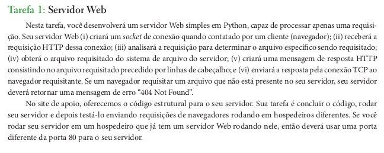

$$ \text{Redes - Web server}$$

  - Entendo o problema
  

  - Analisar o código fornecido pelo livro

--- 
$$ \text{Primeiro teste de solução}$$

> Primeira versão

- Servidor via terminal:
    ```python
    import socket
    from socket import *
    import sys 
    import json

    serverPort = 3334
    serverName = "WebServer"

    serverSocket = socket(AF_INET, SOCK_STREAM)
    serverSocket.bind(('localhost',serverPort))
    serverSocket.listen(1)

    KBYTE = 1024

    while True:
        try:
            connectionSocket, addr = serverSocket.accept()
            message = connectionSocket.recv(KBYTE).decode()
            
            filename = message.split('/')[-1]
            with open(filename, 'r') as file:
                outputdata = file.readlines() 

            connectionSocket.send('status 200 Ok'.encode())
            
            for item in outputdata:
                connectionSocket.send(item.encode())
                connectionSocket.send("\r\n".encode())
            
            connectionSocket.close()
        except FileNotFoundError as e:
            response = '404 file not found'.encode()
            connectionSocket.send(response)
            connectionSocket.close()
            break
            
    serverSocket.close()
    sys.exit()
    ```


- Client via terminal:
    
    ```python
    from socket import *

    host = 'localhost'
    port = 3334

    clientSocket = socket(AF_INET, SOCK_STREAM)
    clientSocket.connect((host, port))


    message = input('Your message: ')
    url = f"http://{host}:{port}/{message}"
    clientSocket.send(url.encode())
    modifiedSentence = clientSocket.recv(1024)

    clientSocket.close()
    ```


> Segunda versão

- Servidor via terminal

    ```python
    import socket
    from socket import *
    import sys 
    import json

    target_host = "localhost" 
    target_port = 3333

    with socket(AF_INET, SOCK_STREAM) as sock:

        sock.setsockopt(SOL_SOCKET, SO_REUSEADDR, 1)
        sock.bind((target_host, target_port))
        sock.listen(1)

        try:
            while True:
                conn, addr = sock.accept()
                message = conn.recv(1024).decode()
                # Redirecionar as rotas
                filename = message.split()[1][1:]
                filename = 'index.html' if filename == '' else filename
                pages = ['index.html','notas.html','redes.html']

                if filename in pages:
                    conn.send('HTTP/1.0 200 OK\r\n'.encode('utf-8'))
                    conn.send("Content-Type: text/html\r\n".encode('utf-8'))
                    with open(filename, 'r') as file:
                        outputdata = file.readlines() 
                    
                    for item in outputdata:
                        conn.send(item.encode('utf-8'))
                        conn.send("\r\n".encode('utf-8'))
                    
                else:
                    conn.send('HTTP/1.0 404 NotFound\r\n'.encode('utf-8'))
                    conn.send("Content-Type: text/html\r\n".encode('utf-8'))               
                    conn.send('<html><body><h1>PageNotFound</body></html>'.encode('utf-8'))
                    raise FileNotFoundError('Arquivo não encontrada')

                conn.close()

        except Exception as e:
            print(e)  
    ```


